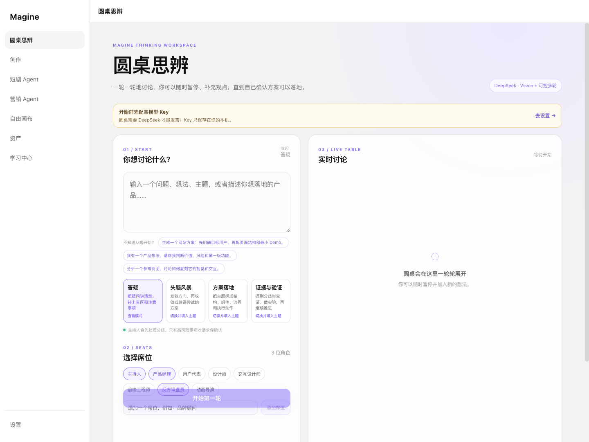
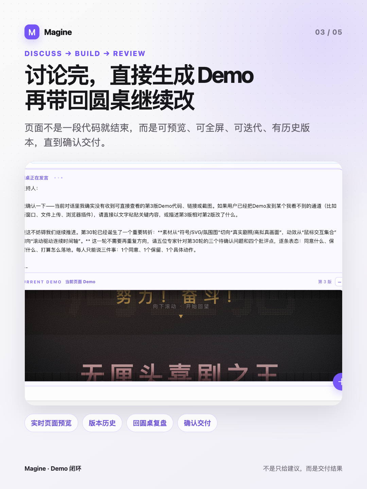
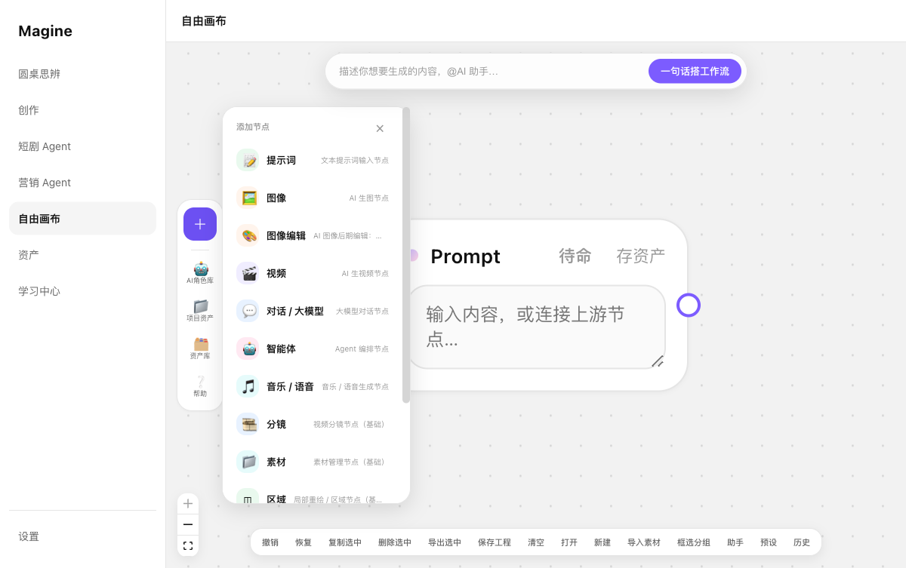

# Magine

Magine 是一个**本地优先、由用户自带 API Key（BYOK）**的 AI 创作工作台。它把“提出问题、多人格讨论、形成方案、生成页面 Demo、回桌复盘、继续迭代，以及图像/视频工作流”放进同一个桌面应用。

> 当前是可运行的个人开源原型，不是云端 SaaS。正式验证的平台为 macOS Apple Silicon；其他平台的状态请查看[兼容性](#兼容性)。



## 为什么做 Magine

普通 AI 对话往往在给出一段建议后结束。Magine 更关注从问题到成果的完整闭环：

```text
问题或想法
  → 多角色圆桌讨论
  → 主持人处理分歧
  → 形成可执行方案
  → 生成页面 Demo 或画布工作流
  → 带结果回圆桌复盘
  → 持续迭代并确认交付
```

## 核心能力

### 圆桌思辨

- 支持答疑、头脑风暴、方案落地、证据与验证四类目标。
- 产品经理、用户代表、设计师、前端工程师、反方审查员等角色逐轮讨论。
- 用户可以暂停，在讨论中插入新观点或参考图，再继续下一轮。
- 主持人识别事实、技术、偏好和目标分歧，优先用核验、最小实验、双方案或暂定推进解决。
- 支持自定义席位、讨论历史和本地草稿恢复。

### 页面 Demo 闭环

- 将已经确认的页面方案送入页面工作台，生成可交互 HTML Demo。
- 每一版 Demo 都保留历史，可全屏预览或在浏览器打开。
- 可以继续输入修改意见，生成下一版，再带 Demo 回圆桌复盘。
- 确认满意后进入交付，不停留在“只给一段 React 代码”的阶段。



### 自由画布

- Prompt、LLM、Agent、图像、图像编辑、视频、音乐、分镜和素材等节点可以连线协作。
- 一句话生成工作流，并在执行前预览预计节点与产出。
- 内置图生视频、抖音图文、营销短片、短剧分镜、产品图和提示词润色模板。
- 生成结果可保存为资产；提示词资产会自动进入“我的提示词预设”。
- 支持工程保存、历史版本、撤销恢复、框选分组和节点尺寸调整。



### 专项 Agent 与资产

- 短剧 Agent：从故事、角色和分镜组织短剧创作流程。
- 营销 Agent：围绕商品卖点、内容结构和渠道素材组织营销流程。
- 资产库：集中管理提示词、文本、图片、视频和音频结果。
- 学习中心：内置画布、Agent、资产和圆桌思辨入门教程。

## 与普通聊天式 AI 的差异

| 普通聊天式 AI | Magine |
| --- | --- |
| 一次回答后由用户自己整理 | 讨论、验证、Demo、复盘和交付形成闭环 |
| 多个角色分别发表意见 | 专家读取前序意见并逐轮收敛 |
| 分歧直接抛给用户选择 | 先判断分歧类型，再核验或做最小实验 |
| 页面方案通常只给代码 | 先生成可看的 Demo，再继续修改 |
| 图像、视频和提示词分散 | 在无限画布和资产库中持续复用 |

## 快速开始

### 环境要求

- Node.js 20 或更高版本
- npm 10 或更高版本（建议）
- 至少一个受支持服务商的 API Key

### 从源码运行

```bash
git clone https://github.com/weibo-job/magine.git
cd magine
npm install
npm run dev
```

启动后进入「设置」，填写你自己的模型 API Key。仓库和安装包均不包含作者的 Key。

### 生产构建

```bash
npm run build
```

生成当前已验证的 macOS Apple Silicon DMG：

```bash
npm run build:mac
```

安装包输出到 `release/`。当前版本未签名，macOS 第一次打开可能提示无法验证开发者；可在 Finder 中右键应用并选择“打开”。

## 模型与 API Key

Magine 采用 BYOK：请求直接发往你配置的模型服务商，费用和额度由对应服务商账户承担。

| 能力 | 当前主要接入 | 是否必需 |
| --- | --- | --- |
| 圆桌、LLM、Agent | DeepSeek | 使用文本与讨论能力时需要 |
| 参考图理解 | DeepSeek Vision / 火山视觉模型 | 使用视觉分析时需要 |
| 图片生成 | 火山引擎方舟 Seedream | 使用生图时需要 |
| 视频生成 | 火山引擎方舟 Seedance | 使用生视频时需要 |
| 音乐、语音、视频备选 | MiniMax 等 | 仅使用对应能力时需要 |

模型名称、接口权限、区域可用性和计费可能由服务商调整，请以各自控制台为准。项目不会替你购买额度，也不会提供公共中转 Key。

## 兼容性

“源码可以构建”不等于“已经正式验证”。当前兼容状态如下：

| 系统 | 状态 | 说明 |
| --- | --- | --- |
| macOS Apple Silicon（M1 及更新） | **已验证** | 当前正式支持；可生成 ARM64 DMG |
| macOS Intel | **未验证** | Electron 源码目标兼容，但暂无 x64/Universal 安装包 |
| Windows 10/11 | **未验证** | 前端与大部分 Electron 能力可移植；暂无 NSIS 安装包，终端命令层仍需适配 |
| Linux | **未验证** | 前端与大部分 Electron 能力可移植；暂无 AppImage/deb 安装包 |
| 现代桌面浏览器 | **部分可用** | 圆桌、页面和画布可运行；本地文件对话框、终端与部分 Electron 能力会降级 |

当前不能宣传为“全平台正式支持”。欢迎 Windows、Linux 和 Intel Mac 用户提交真实构建结果与兼容性修复。

## 本地数据与安全

- API Key 使用用户口令加密后存入本地浏览器存储；解锁后的明文只驻留在当前运行内存。
- 圆桌草稿、Demo 历史、画布本地版本和资产默认保存在当前设备。
- `.magine` 工程文件由用户选择位置保存，不会自动上传到仓库或云端。
- Agent 环境工具可以读取工作区文件并执行本地命令。只在可信工程中启用，不要把未知网页或第三方提示直接当作终端指令执行。
- 如果 Key 曾出现在提交、日志、截图或公开 Issue 中，请立即到服务商控制台撤销并重新创建。

更完整的安全说明见 [SECURITY.md](SECURITY.md)。

## 当前限制

- 暂无官方云端同步、多人协作和公网 Demo 托管。
- Windows、Linux、Intel Mac 安装包尚未构建和验证。
- `web_search`、子代理会话管理等部分环境工具仍是预留能力。
- 媒体生成是否成功取决于用户自己的模型权限、额度、接口版本和网络环境。
- 本地原型尚未完成代码签名、公证、自动更新和完整端到端测试。

## 项目结构

```text
electron/        Electron 主进程与本地文件/环境工具桥接
public/          运行时静态资源与风格预览
src/canvas/      自由画布、节点、工具栏和工作流编排
src/gateway/     DeepSeek、火山、Seedream、Seedance 等模型网关
src/pages/       圆桌、Agent、资产、学习中心和页面工作台
src/roundtable/  圆桌状态、分歧处理和 Demo 历史
src/settings/    BYOK 配置与本地加密保险库
```

## 参与贡献

欢迎提交 Issue 和 Pull Request，尤其是：

- Windows、Linux、Intel Mac 的构建与真实测试结果
- Agent 本地命令权限与安全边界改进
- 模型接口兼容性修复
- 圆桌收敛质量、Demo 迭代和画布交互优化

提交安全问题前请先阅读 [SECURITY.md](SECURITY.md)，不要在公开 Issue 中粘贴真实 API Key。

## License

[MIT](LICENSE) © 2026 fusu
